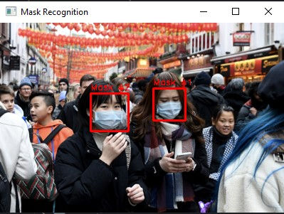
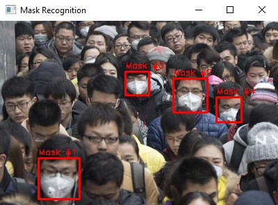
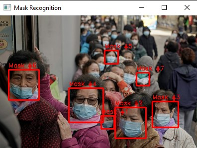

# Reconhecimento de pessoas utilizando máscaras

### Descrição

Algoritmo Haar Cascade treinado para reconhecer pessoas utilizando máscaras.

**Integrantes da dupla:** Rhodrigo Picinini (1125147) e Tomás Biasotto (1125129)

> Imagens positivas e negativas utilizadas: 
> https://drive.google.com/drive/folders/1kVPQ6bN_kxeFy2ELEXfx0zLV7l5gkP30?usp=sharing

### Último estágio do treinamento

### Exemplos de aplicação

 
